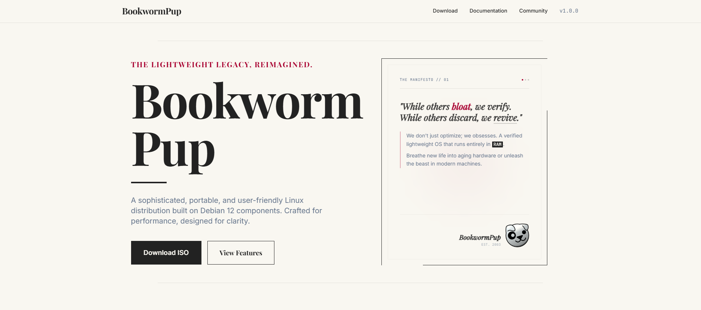
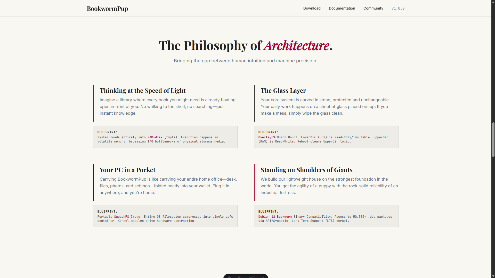
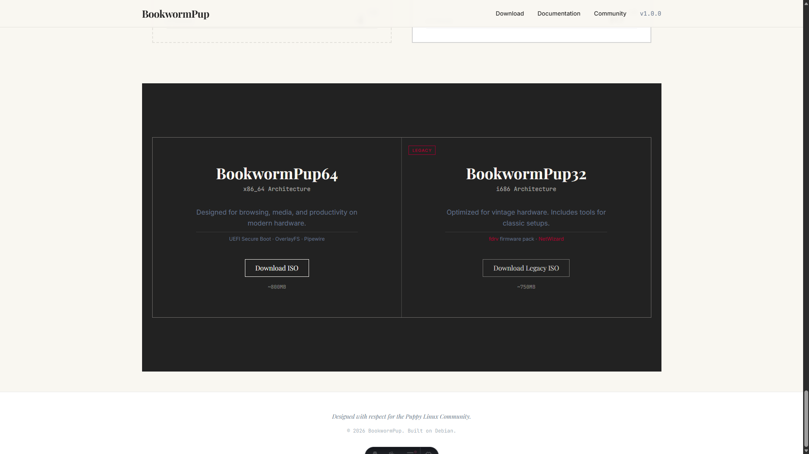

# BookwormPup Linux Website

This repository contains the source code for the BookwormPup Linux distribution's informational website. The project is built using the Astro web framework and Tailwind CSS, focusing on a "Modern Retro" aesthetic while providing technical details about the operating system.
---

---
## Project Description

BookwormPup Linux is a light-weight Linux distribution based on Debian. This website serves as a technical landing page and showcase for the OS, highlighting its architecture, persistence mechanisms, and system requirements.

## Technology Stack

The project utilizes the following technologies:

*   **Framework**: Astro v5.17.1
*   **Styling**: Tailwind CSS v3.4.19
*   **Fonts**: 
    *   Inter (Sans-serif)
    *   Playfair Display (Serif)
    *   JetBrains Mono (Monospace)
*   **Integrations**: `@astrojs/tailwind`

## Repository Structure

*   `src/components/`: Modular Astro components representing different sections of the website (e.g., `TechSpecs.astro`, `Architecture.astro`, `Persistence.astro`).
*   `src/layouts/`: Base layout templates, primarily `Layout.astro` which handles the global structure, header, and footer.
*   `src/pages/`: Main entry points for the website, including the landing page (`index.astro`) and features detail page (`features.astro`).
*   `dist/`: Directory for the generated production build.

## Development Procedures

### Prerequisites

*   Node.js (LTS version recommended)
*   npm

### Installation

To install dependencies, run:

```bash
npm install
```

### Local Development

To start the development server with live reloading:

```bash
npm run dev
```

The site will typically be available at `http://localhost:4321`.

### Production Build

To generate the static production files:

```bash
npm run build
```

The output will be located in the `dist/` directory.

### Preview Build

To preview the production build locally:

```bash
npm run preview
```
---

---

## Maintenance

The website's content is managed through Astro components in `src/components/`. Updates to technical specifications or OS features should be made directly in the corresponding `.astro` files.
---
## BOOKWORMPUP OFFICIAL
- https://bwpup.puppylinux.com/
- https://forum.puppylinux.com/
- https://wikka.puppylinux.com/HomePage
---
